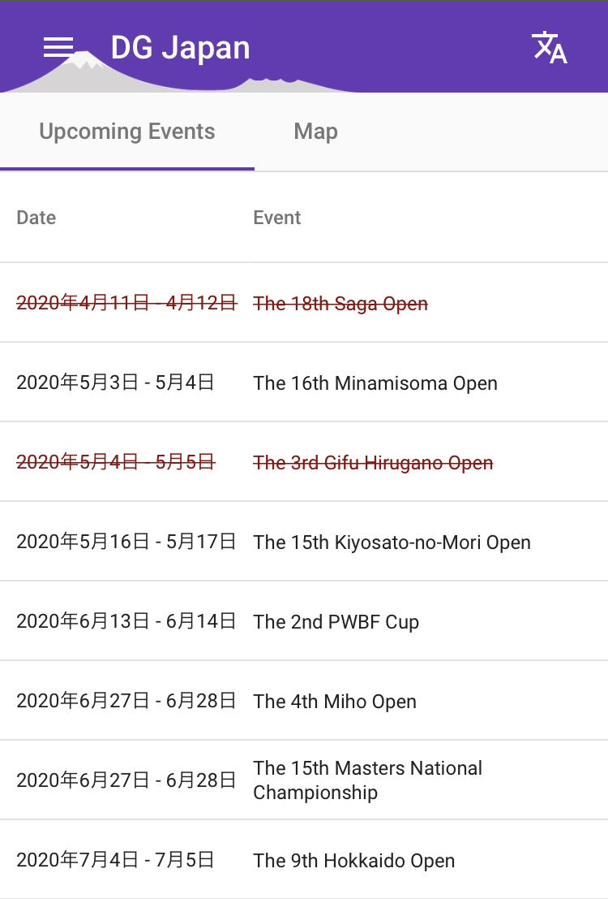
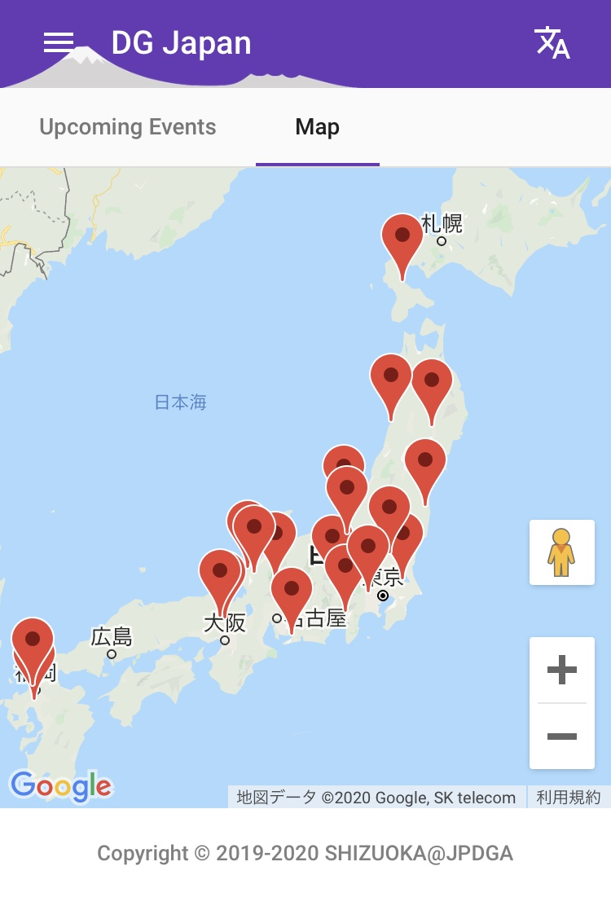
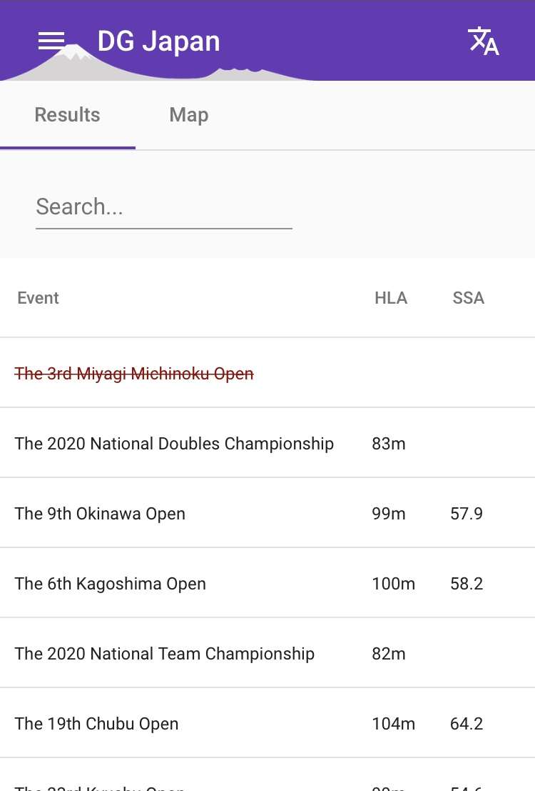
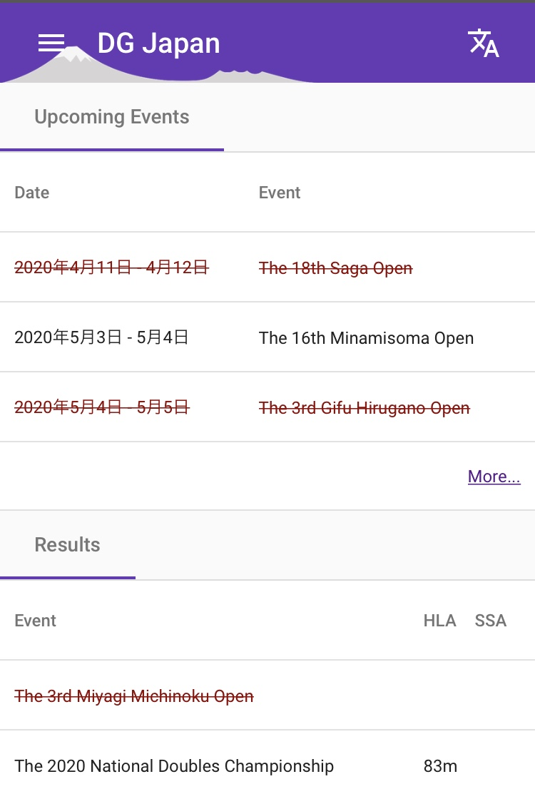
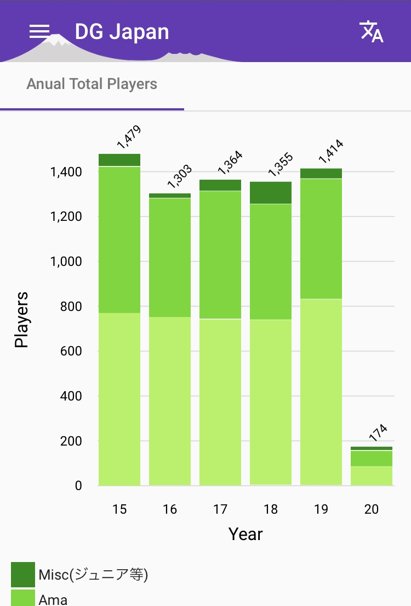

[](https://travis-ci.org/jpdga-shizuoka/ssa-round-ratings)


This is a small project for disc golfers who love playing disc golf in Japan.

## Screen shots

<table>
  <tbody>
    <tr>
      <td>
      <td>
      <td>
    </tr>
    <tr>
      <td>
      <td>
      <td>
    </tr>
  </tbody>
</table>

## Website

The [DG Japan](https://jpdga-shizuoka.github.io/ssa-round-ratings/) which is a website for this project is running on the GitHub Pages.

## Deploy

Do the following procedure in order to deploy this project to Github Pages.

```shell
ng deploy
```

## References

* Web Application Framework: [Angular](https://angular.io)
* Deploy to Github Pages: [angular-cli-ghpages](https://github.com/angular-schule/angular-cli-ghpages)

## Author
KINOSHITA minoru
